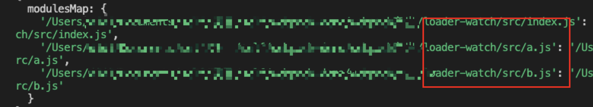

## webpack的watch模式下因 loader 缓存导致的问题
### 问题概述

一个简单的场景，需要记录项目中使用到的的页面或者组件资源，其中一个方法是将逻辑写在loader中，这样资源经过loader编译的时候可以统计到。但是在watch模式下会产生一个问题，修改完其中一个文件后，这个文件重新走loader，其他没有修改的文件不会再走loader，导致本次编译后统计的资源丢失。
### 场景复现
例如 demo 中的部分 webpack 配置，使用了自定义的 TestWebpackPlugin 和 _babel-loader。

``` javascript
// webpack.config.js
module.exports = {
  plugins: [
    new TestWebpackPlugin()
  ],
  module: {
    rules: [
      {
        test: /\.js$/,
        use: ['_babel-loader']
      }
    ]
  }
}
```
另外配置了loader的解析路径，能访问到自定义的loader
```javascript
resolveLoader: {
  modules: ['node_modules', path.resolve(__dirname, 'loaders')]
},
```

webpack在[thisCompilation](https://v4.webpack.docschina.org/api/compiler-hooks/#thiscompilation)钩子中先初始化compilation._testObj_对象；

``` javascript
// plugins/TestWebpackPlugin.js
let testObj
if (!compilation.__testObj__) {
  testObj = compilation.__testObj__ = {
    modulesMap: {}
  }
}
```

然后 loader 阶段执行 _babel-loader.js 逻辑，将上阶段初始化的modulesMap赋值给常量，loader 解析的路径加到modulesMap 对象中，loader 依次处理三个文件;

``` javascript
// loaders/_babel-loader.js
const testObj = this._compilation.__testObj__
  
if (!testObj) {
  return source
}

const modulesMap = testObj.modulesMap
if (!modulesMap[this.resourcePath]) {
  modulesMap[this.resourcePath] = this.resourcePath
}
```
> this.resourcePath资源文件的路径。

处理完后会进入到 emit 钩子(这个时候已经 modulesMap 已经有了三个值)：键值都是对应的文件路径


这时候改变文件内容触发下一次编译（我这里修改b.js文件）：

 => 

只有修改的文件会再次经过_babel-loader.js的处理，再看此时modulesMap：


只收集到修改过的b.js的路径。

### 问题造成原因
loader默认是开启缓存功能的，而每次触发编译的过程中，都会生成一个 compilation 对象，实际上 compilation 对象是每单独一次编译的流程和数据中心，从编译开始、文件输出到最后的日志输出，都关联在 compilation 上。而控制是否需要编译（是否走缓存）的代码在webpack/lib/Compilation.js的addModule方法中：
```javascript
// webpack/lib/Compilation.js的addModule
addModule(module, cacheGroup) {
    const identifier = module.identifier();
    const alreadyAddedModule = this._modules.get(identifier);
    if (alreadyAddedModule) {
      return {
        module: alreadyAddedModule,
        issuer: false,
        build: false,
        dependencies: false
      };
    }
    const cacheName = (cacheGroup || "m") + identifier;
    if (this.cache && this.cache[cacheName]) {
      const cacheModule = this.cache[cacheName];
      if (typeof cacheModule.updateCacheModule === "function") {
        cacheModule.updateCacheModule(module);
      }
      let rebuild = true;
      if (this.fileTimestamps && this.contextTimestamps) {
        rebuild = cacheModule.needRebuild(
          this.fileTimestamps,
          this.contextTimestamps
        );
      }
      if (!rebuild) {
        cacheModule.disconnect();
        this._modules.set(identifier, cacheModule);
        this.modules.push(cacheModule);
        for (const err of cacheModule.errors) {
          this.errors.push(err);
        }
        for (const err of cacheModule.warnings) {
          this.warnings.push(err);
        }
        return {
          module: cacheModule,
          issuer: true,
          build: false,
          dependencies: true
        };
      }
      cacheModule.unbuild();
      module = cacheModule;
    }
    this._modules.set(identifier, module);
    if (this.cache) {
      this.cache[cacheName] = module;
    }
    this.modules.push(module);
    return {
      module: module,
      issuer: true,
      build: true,
      dependencies: true
    };
  }
```
这里有一个needrebuild 判断是否需要重新编译（this.fileTimestamps 、this.contextTimestamps：首次或前一次编译存储的文件最后变更记录）。

### 解决办法
###### 这里我发现一共有两个解决办法：
###### （1）强制让loader中不使用缓存,简单粗暴


这样不管怎么修改所有的js文件都会经过_babel-laoder再次进行编译。
再次场景复现进行断点调试，能看到只修改b.js文件后index.js,a.js和b.js也都再次经过_babel-laoder的处理。


###### （2）重写 addModule 方法
在 _babel-laoder 中用 this._module.buildInfo 保存编译过的文件（各个模块各自保存编译过的标记，当走缓存时能在plugin中读取到该标记），TestWebpackPlugin中重写 addModule 方法，保留原有逻辑判断的同时加入判断需要走缓存时（不需要重新编译的时候），手动加入缓存文件。
```javascript

const buildInfo = this._module.buildInfo
buildInfo.modulesMap = buildInfo.modulesMap || {}
buildInfo.modulesMap[this.resourcePath] = testObj.modulesMap[this.resourcePath] = this.resourcePath

```
> this._module一种 hack 写法。用于访问当前加载的 Module 对象。
```javascript
const rawAddModule = compilation.addModule
      compilation.addModule = (...args) => {
        const addModuleResult = rawAddModule.apply(compilation, args)
        if (!addModuleResult.build && addModuleResult.issuer) {
          const buildInfo = addModuleResult.module.buildInfo
          if (buildInfo.modulesMap) {
            Object.assign(testObj.modulesMap, buildInfo.modulesMap)
          }
        }
        return addModuleResult
      }
    })
```
同样再进行断点调试，首次处理三个文件依次经过处理，能看到buildInfo将处理过的文件路径进行了缓存（我这里文件路径过长所以没能展示出具体文件名，依次是index.js、a.js、b.js）：


当修改b.js文件后，index.js和a.js文件因为走缓存会经过这步逻辑将module中保存的标记取出。


而b.js则还是经过_babel-loader.js的处理最后到emit钩子中成功输出所有模块：



### 总结
只是在这个 demo 场景下，loader 中还加入了其他的处理逻辑，比如收集 modulesMap 等，所以才导致的失效。
根据实际情况，如果收集 modulesMap 的过程与新增或删除依赖无关，其实可以把modulesMap直接挂载到 compiler 对象上，也能避免这种情况。
